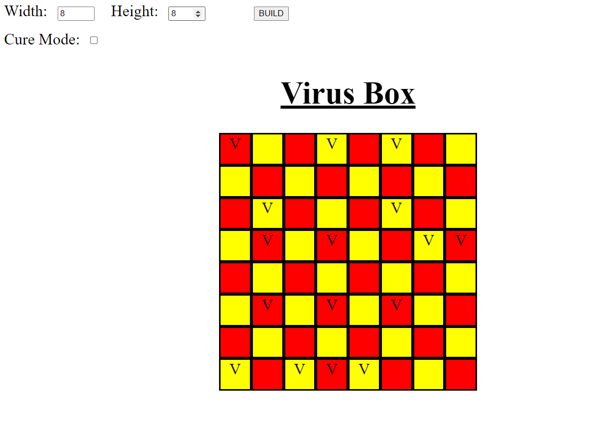

# virus
Basic demonstration on how virus spread through direct contact.
There two mode: 
1. One mode in which we allow the spread of a virus by clicking on an infected cell.
2. Another mode in which clicking the infected can cure a cell.

